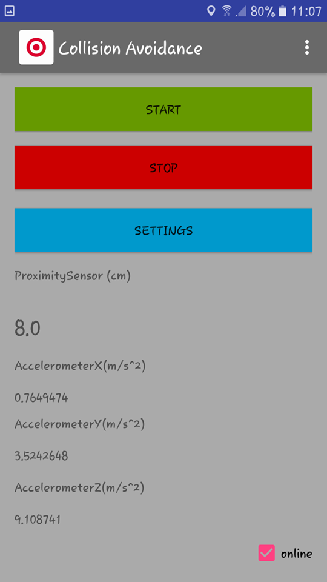

	Collision Avoidance

ΜΑΘΗΜΑ: Ανάπτυξη Λογισμικού για Δίκτυα και Τηλεπικοινωνίες

ΔΕΥΤΕΡΟ ΠΑΡΑΔΟΤΕΟ

ΟΜΑΔΑ ΕΚΠΟΝΗΣΗΣ ΕΡΓΑΣΙΑΣ:
	
	ΟΝΟΜΑΤΕΠΩΝΥΜΟ				Α.Μ.
	ΓΙΩΤΗ ΓΕΩΡΓΙΑ				1115201200026
	ΓΟΥΛΕΤΑΣ ΜΙΧΑΛΗΣ			1115201200028
	ΔΗΛΑΚΗ ΑΓΓΕΛΙΚΗ				1115201200031
	ΧΑΤΖΗΕΛΕΥΘΕΡΙΟΥ ΚΩΝ/ΝΑ			1115201200198
...................................................................................................................................................

ΚΕΦΑΛΑΙΟ 1

Το Automation System (Pub/Sub extension) είναι η εντός σύνδεσης επέκταση της αρχικής εφαρμογής (εκτός σύνδεσης) για την αποφυγή σύγκρουσης μεταξύ δύο τερματικών κινητών συσκευών (Android). Η εφαρμογή Android λειτουργεί με δύο καταστάσεις λειτουργίας (offline και online) και μεταβάλλει την κατάσταση με βάση την κατάσταση συνδεσιμότητας του κινητού τερματικού. H εναλλαγή αυτή γίνεται τόσο αυτόματα όσο και με τη χρήση κουμπιού. Ο χρήστης έχει τη δυνατότητα να επιλέξει αν η λειτουργία θα είναι Manual ή Automatic. Σε περίπτωση που επιλεγεί Manual έχει τη δυνατότητα να επιλέξει την κατάσταση σύνδεσης (online/offline) ενώ σε διαφορετική περίπτωση το αντίστοιχο κουμπί δεν είναι διαθέσιμο. Το κουμπί αυτό είναι επίσης λειτουργικό μόνο στην περίπτωση που υπάρχει συνδεσιμότητα στο τερματικό ώστε να είναι εφικτό να αλλάξει την κατάσταση λειτουργίας της εφαρμογής σε “εκτός σύνδεσης”.

...................................................................................................................................................

Android Studio

...................................................................................................................................................

ΠΡΟΣΘΗΚΕΣ
Στις ρυθμίσεις της εφαρμογής προστέθηκαν και οι παράμετροι που είναι απαραίτητες για τη σύνδεση με τον MQTT broker (IP, Port). Οι ρυθμίσεις των
αισθητήρων στην Android εφαρμογή δεν θα λαμβάνονται υπόψιν στην online λειτουργία. 
Στην κλάση DataSettings προστέθηκαν δύο μεταβλητές όπου αποθηκεύονται οι επιλογές του χρήστη για καταστάσεις Manual/Automatic και online/offline.
Στην κλάση SensorsData  προστέθηκε η μεταβλητή location ώστε να αποθηκεύεται η τοποθεσία του τερματικού που στέλνει το εκάστοτε μήνυμα.

--> oncheckedchanged(package)
    --> OnOnlineOffLineCheckChanged(class): Στην κλάση αυτή ελέγχουμε την τιμή του checkbox που βρίσκεται στο main activity και αφορά την επιλογή του 		χρήστη να βρίσκεται online ή offline όταν βρίσκεται σε λειτουργία Manual.

--> onsensoreventlisteners(package)
    --> OnAccelerometerSensorEventListener(class): Στην κλάση αυτή προστέθηκε το κομμάτι που αφορά στο αν η εφαρμογή θα τρέχει σε τοπικό επιπέδο(όπως 		στο πρώτο παραδοτέο), ή αν θα τρέχει μέσω του MQTT broker. Αυτό γίνεται με τη χρήση μιας boolean μεταβλητής(usemqtt). Στον παρακάτω πίνακα 		φαίνεται πού τρέχει η εφαρμογή στην εκάστοτε περίπτωση: 

--> threads(package)
Στο πακέτο αυτό διαχειριζόμαστε τα threads της android εφαρμογής.
    	--> GpsNetworkThread(class): η κλάση αυτή αποτελεί το thread που αφορά την παρακολούθηση της συνδεσιμότητας του gps και του internet. 		Ταυτόχρονα ελεγχει τη διαθεσιμότητα του checkbox για τις καταστασεις online/offline.
    	
	--> MosquitoControllerTerminal(class): η κλάση αυτή διαχειρίζεται τα μηνύματα που στέλνονται από τον MQTT broker. Μέσω της συνάρτησης 		publishToAdministrator, αποστέλλονται στον administrator τα μηνυματα που προέρχονται από τα δύο τερματικά. Η συνάρτηση Subscribe είναι αυτή 		που καλείται καθε φορά που συνδέεται ένα νέο τερματικο ή ένα ίδιο τερματικό του οποίου όμως το uniquenumber έχει αλλάξει.Παρατηρήσαμε 		ότι χρειάζεται διαφορετικό id για το publish-subscribe, οπότε και διαφοροποιήσαμε το myid στην πρώτη περίπτωση. Η συνάρτηση MessageArrived 		καλείται αυτόματα κάθε φορά που λαμβάνεται μήνυμα και στέλνεται κατάλληλη ειδοποίηση μέσω ηχητικού μηνύματος στα αντίστοιχα topic-τερματικά.
	
	-->PublishThread (class): η συνάρτηση αυτή μέσω της συνάρτησης publishToAdministrator του MosquitoControllerTerminal αφού συντάξει το μήνυμα 		το στέλνει στον Administrator.
	
	-->SubscribeThread (class): η συνάρτηση αυτή μέσω της συνάρτησης subscribe του MosquitoControllerTerminal κάνει subscribe στο αντιστοιχο 		topic.

Το id της συσκευής παράγεται μια φορά, κατά την πρώτη εκτέλεση της εφαρμογής. Η μοναδικότητα του ονόματος επιτυγχάνεται με την παραγωγή μοναδικού αναγνωριστικού μέσω συνάρτησης κατακερματισμού.

-->uniquenumber(package)
Περιέχει τις κλάσεις που παράγουν το μοναδικό αναγνωριστικό.
	-->CreateUniqueNumber
	Αφού ενώσουμε σε μία συμβολοσειρά την MAC address και το ID της συσκευής, τη στέλνουμε σαν όρισμα στην συνάρτηση κατακερματισμού. Για 		την δεύτερη συσκευή, λόγω δικαιωμάτων του android 6.0.1, θέτουμε δικό μας αναγνωριστικό (000000000000000000000000000000000).
	
	-->MD5Hash
	Η συνάρτηση κατακερματισμού.

...................................................................................................................................................
IntelliJ Idea

Σε κατάσταση λειτουργίας online, η εφαρμογή επεκτάθηκε κατάλληλα ώστε να αποστέλλει σε πραγματικό χρόνο (publish) και κατάλληλο topic το όνομα του
τερματικού, τον τύπο των αισθητήρων, την τρέχουσα μέτρηση των αισθητήρων, την τρέχουσα ημερομηνία και ώρα καθώς και την τρέχουσα τοποθεσία GPS υπό τη μορφή συντεταγμένων στο κεντρικό σύστημα MQTT broker. Ταυτόχρονα, εγγράφεται επιτυχώς στον MQTT broker σε κατάλληλο topic για την λήψη ειδοποιήσεων σύγκρουσης (subscribe). Τέλος, λαμβάνει επιτυχώς τα κατάλληλα μηνύματα ειδοποίησης σύγκρουσης (receive message), καθώς και αναπαράγει ήχο και μήνυμα ειδοποίησης. Σημειώνεται ότι το μήνυμα ειδοποίησης πιθανής σύγκρουσης σε offline λειτουργία είναι διαφορετικό από το αντίστοιχο μήνυμα σε online λειτουργία.
O MQTT broker βασίζεται στην υλοποίηση του mosquitto και εκτελείται τοπικά στο ίδιο σύστημα με την Java εφαρμογή και τη MySQL βάση δεδομένων.
H Java εφαρμογή λαμβάνει τις τιμές από από τις δύο εφαρμογές Android (subscribe) σε κατάλληλο topic. Υπολογίζει την πιθανότητα σύγκρουσης με βάση τις τιμές των αισθητήρων και τα ορισμένα από τη Java εφαρμογή κατώφλια (Settings tab). Για κάθε πιθανότητα σύγκρουσης που εντοπίζεται αποθηκεύει σε βάση δεδομένων ΜySQL εγγραφή που περιλαμβάνει τα πεδία που έχουν αποσταλεί από το τερματικό και αφορούν την πιθανή σύγκρουση (όνομα του τερματικού, τοποθεσία πιθανής σύγκρουσης υπό τη μορφή συντεταγμένων, τύπο και μέτρηση του αισθητήρα που οδήγησε στον εντοπισμό, ημερομηνία και ώρα ανίχνευσης).
Στη συνέχεια αποστέλλει μήνυμα ειδοποίησης σύγκρουσης (publish) στον MQTT broker με το κατάλληλο topic, απ’ τον οποίο θα ειδοποιείται αυτόματα μόνο το εμπλεκόμενο με τη σύγκρουση τερματικό.
Σε περίπτωση που εντοπιστούν δυο πιθανές συγκρούσεις (μια για κάθε τερματικό Android) με χρονική απόσταση όχι μεγαλύτερη του ενός δευτερολέπτου θεωρείται επιβεβαιωμένη πιθανότητα σύγκρουσης μεταξύ των δύο τερματικών και μεταβάλλονται οι αντίστοιχες δύο εγγραφές της βάσης ως “επιβεβαιωμένες” καθώς αποστέλλεται και κατάλληλο μήνυμα ειδοποίησης σύγκρουσης (publish) στον MQTT broker με το κατάλληλο topic (results), απ’ το οποίο ειδοποιούνται αυτόματα και τα 2 Android τερματικά.

Η Java εφαρμογή συνοδεύεται από γραφικό περιβάλλον παρακολούθησης των πιθανών συγκρούσεων βασισμένο σε Java FX. Συγκεκριμένα, περιλαμβάνει 2 οθόνες που
παρουσιάζονται με τη μορφή tab:

1) Η πρώτη οθόνη περιλαμβάνει πολυκριτηριακή αναζήτηση με βάση οποιοδήποτε πεδίο της βάσης (εκτός αυτών των οποίων η τιμή δεν μεταβάλλεται πχ μονάδες μέτρησης), ή συνδυασμό αυτών. Η εφαρμογή επιστρέφει τα αποτελέσματα της αναζήτησης από τη βάση δεδομένων και τα παρουσιάζει στο κάτω μέρος του γραφικού περιβάλλοντος. Επιπλέον, υπάρχει η δυνατότητα καθαρισμού των πεδίων μέσω του κουμπιού Clear.

2) Η δεύτερη οθόνη περιλαμβάνει τη ρύθμιση των κατωφλιών των αισθητήρων και της συχνότητας δειγματοληψίας των μηνυμάτων που λαμβάνει ο MQQT broker.

Τέλος, χρησιμοποιούνται δύο threads στην Java εφαρμογή για την εξυπηρέτηση της λειτουργίας των διαφορετικών tasks. Το main thread αφορά τα γραφικά, ενώ το δευτερεύον τη διαχείριση ολόκληρης της εφαρμογής από τον administrator (εκτέλεση αλγορίθμων, λήψη μηνυμάτων, αποστολή μηνυμάτων κλπ).

Τεχνολογίες συστήματος ανάπτυξης:
1. Java Oracle SE 8 (Java FX included)
2. Android API 4.2.2 και 6.0.1
3. Android Studio (Εργαλείο ανάπτυξης της Android εφαρμογής)
4. IntelliJ IDEA (Εργαλείο ανάπτυξης της Java εφαρμογής)
4. MQTT mosquitto broker
5. Eclipse Paho (Java & Android MQTT client)
6. MySQL Community server
7. JDBC
...................................................................................................................................................

ΑΝΑΛΥΣΗ ΚΩΔΙΚΑ

....................................................................................................................................................

-->administratorcontroller(package): στο πακέτο αυτό διαχειριζόμαστε:
   	-->AdminController: η κλάση αυτή αποτελεί το δευτερεύον thread της εφαρμογής Java, το οποίο διαχειρίζεται την εκτέλεση αλγορίθμων, την λήψη 		και αποστολή μηνυμάτων, την επικοινωνία με τη βάση δεδομένων κλπ, όπως αναφέρθηκε παραπάνω.
	Αρχικά, αποκτάμε πρόσβαση στη διαμοιραζόμενη μνήμη, καθώς και στον MQTT broker. Στη συνέχεια, γίνεται subscribe στα 2 topic(2 τερματικά).
	Όσο το νήμα δεν διακόπτεται, παραμένει αδρανές μέχρι να διακοπεί. Τέλος, μετά την διακοπή του κάνει unsubscribe.
  	
	 -->MosquitoControllerTerminal: η κλάση αυτή διαχειρίζεται τα μηνύματα που στέλνονται από τον MQTT broker. Μέσω της συνάρτησης 		   		PublishToTerminals, αποστέλλεται κατάλληλο μήνυμα ειδοποίησης σύγκρουσης (publish) στον MQTT broker με το κατάλληλο topic(result), στο οποίο 		έχουν πρόσβαση και τα 2 τερματικά. Η συνάρτηση MessageArrived καλείται αυτόματα κάθε φορά που λαμβάνεται μήνυμα. Το μήνυμα διαχωρίζεται στα 		κατάλληλα πεδία και αφού γίνει ο έλεγχος σύγκρουσης με τα αντίστοιχα κατώφλια, τα στοιχεία του μηνύματος εισάγονται στη βάση δεδομένων αν και 		εφόσον ξεπεραστούν. Επίσης, στέλνεται κατάλληλο μήνυμα ειδοποίησης στα αντίστοιχα topic-τερματικά.
	
--> data (package)
Στο συγκεκριμένο πακέτο διαχειριζόμαστε:

	-->DataSettings (class)
	την κλάση  στην οποίο αρχικοποιούνται οι αρχικές τιμές του κατωφλιού του πρώτου αισθητήρα (fisrtsensorvalue) και των κατωφλιών για τον κάθε 		άξονα του δεύτερου αισθητήρα. Επίσης κάθε φορά που ο χρήστης πατάει το κουμπί SAVE οι τιμές τροποποιούνται και αποθηκεύονται στις αντίστοιχες 		μεταβλητές.

	-->SensorsData (class)
	την κλάση στην οποία αρχικοποιούνται το id της γραμμής και η ημερομηνία και ώρα του πιο πρόσφατου δείγματος. 
	Οι τιμές αυτές, αν και αποθηκεύονται στη βάση δεδομένων, πρέπει να τις αποθηκεύουμε και στη μνήμη του υπολογιστή, ώστε να μπορούμε να 		συγκρίνουμε τιμές μεταξύ των τερματικών, για να ανιχνεύουμε επιβεβαιωμένες συγκρούσεις.

--> databaseconnection (package)
Στο πακέτο αυτό διαχειριζόμαστε τις κλάσεις:
    --> Queries(class)
    Στη συγκεκριμένη κλάση γίνεται η σύνδεση με τη βάση δεδομένων μέσω του JDBC και τα ερωτήματα προς αυτή. Αρχικά, υλοποιείται η συνάρτηση search, 	η οποία θέτει το ερώτημα για αναζήτηση στη βάση δεδομένων και εμφανίζονται τα αποτελέσματα. Επιπλέον, υλοποιείται η συνάρτηση insert, μέσω της 	οποίας, για κάθε μήνυμα που λαμβάνει ο διαχειριστής, εισάγει μια νέα γραμμή στη βάση, ενώ κρατάει και το πρωτεύον κλειδί της γραμμής που αφορά το 		ίδιο τερματικό για την αμέσως προηγούμενη εισαγωγή, ώστε να το αποθηκεύσουμε στην κλάση SensorsData. Τέλος, μέσω της συνάρτησης update, 	ενημερώνεται η εκάστοτε γραμμή σε περίπτωση αλλαγής της κατάστασης σύγκρουσης.

	--> SampleLine(class)
	Η κλάση στην οποία αποθηκεύονται τα στοιχεία μιας γραμμής του πίνακα και εκτυπώνονται μέσω της συνάρτησης toString.

	--> SampleTable(class)
 	Η κλάση που αντιστοιχεί σε έναν πίνακα, ο οποίος περιέχει τα αποτελέσματα κάποιου ερωτήματος, δηλαδή περιέχει μια λίστα από SampleLine.
    
--> datahandler (package)
    --> Data Handler (class)
    Η συγκεκριμένη κλάση διαχειρίζεται την ανάγνωση(LoadFromDisk) και την εγγραφή(SaveToDisk) από και πρός τον δίσκο, αντίστοιχα, των τιμών των 	κατωφλιών των αισθητήρων για τις μεταβλητές του DataSettings.

--> javafxcontroller(package)
    Το πακέτο αυτό περιέχει όλους τους controllers που διαχειρίζονται το GUI(FX).
    
	--> FXController(class)
       	Στην κλάση αυτή:
	Αρχικά, γίνεται η σύνδεση με όλα τα TextField, Checkbox κλπ που υπάρχουν στα δύο tab της εφαρμογής.
	Επιπλέον, υλοποιείται η συνάρτηση onSaveSettings, η οποία χρησιμεύει στην αποθήκευση στον δίσκο, των κατωφλιών που θέτει ο χρήστης στο tab 		Settings.
	Στη συνέχεια, υλοποιείται η συνάρτηση onSearchDatabase, μέσω της οποίας γίνεται η αναζήτηση στη βάση δεδομένων αφού πατηθεί το κουμπί Search 		στο αντίστοιχο tab και εμφανίζει τα αποτελέσματα στο GUI, μέσω και της κλάσης Queries, όπως αναφέρθηκε παραπάνω. Tέλος, υλοποιείται η 		συνάρτηση OnClear που καλείται με το πάτημα του αντίστοιχου κουμπιού και χρησιμεύει στον καθαρισμό του GUI.

--> parameter(package)
    Περιέχει την κλάση στην οποία αποθηκεύονται οι παράμετροι π.χ. κωδικός, Mosquito_port, Mosquito_ip κλπ.
    --> ParameterSettings(class)
     Η κλάση αυτή διαχειρίζεται τα settings της εφαρμογής.

-> parameterhandler(package)
   -->ParameterHandler(class)
   Η κλάση αυτή διαβάζει τις παραμέτρους σύνδεσης της βάσης και του Mosquito broker από το αρχείο config.properties, και τις αποθηκεύει στις 		αντίστοιχες μεταβλητές της κλάσης ParameterSettings.

--> singleton(package)
    --> SharedMemory(class)
       Δημιουργία μιας κοινής μνήμης η οποία είναι προσπελάσιμη απο το main thread(GUI) και από το δευτερεύον thread(Administrator), ακολουθώντας το 		singleton pattern, η οποία περιλαμβάνει τα DataSettings και τα ParameterSettings.

....................................................................................................................................................

Βάση Δεδομένων

Η μορφή της βάσης δεδομένων είναι η παρακάτω:

Δημιουργείται μέσω του αρχείου database.sql και η σύνδεση σε αυτή  γίνεται μέσω της κλάσης Queries (και του JDBC) κάθε φορά που τίθεται κάποιο ερώτημα (search, insert, update).

        
ΠΗΓΕΣ
 http://stackoverflow.com/questions/4846484/md5-hashing-in-android
 http://stackoverflow.com/questions/14376807/how-to-read-write-string-from-a-file-in-android
 http://www.androidhive.info/2012/07/android-gps-location-manager-tutorial/
 http://stackoverflow.com/questions/25713157/generate-int-unique-id-as-android-notification-id
 http://stackoverflow.com/questions/20348657/cannot-load-properties-file-from-resources-directory
 http://stackoverflow.com/questions/10601648/how-to-change-the-text-of-textfield-in-java-fx-2
 http://stackoverflow.com/questions/26752443/how-to-set-text-of-a-textarea-in-javafx-from-constructor
 http://stackoverflow.com/questions/7974154/how-do-i-print-messages-to-the-screen-in-my-java-gui
 http://stackoverflow.com/questions/20446026/get-value-from-date-picker
 http://stackoverflow.com/questions/37787079/intellij-unable-to-use-newer-java-8-classes-error-usage-of-api-documented
 http://stackoverflow.com/questions/12900373/idea-javac-source-release-1-7-requires-target-release-1-7
 http://docs.oracle.com/javase/6/docs/api/java/text/SimpleDateFormat.html
 https://examples.javacodegeeks.com/core-java/text/java-simpledateformat-example/
 http://stackoverflow.com/questions/9872419/how-to-convert-a-string-to-a-date-using-simpledateformat
 https://developer.android.com/training/permissions/requesting.html

ΚΕΦΑΛΑΙΟ 2

Η εφαρμογή πριν την επέκταση:

1.main activity

2.main activity STOPPED 
										

3.settings activity

....................................................................................................................................................

Η εφαρμογή μετά την επέκταση:

1.main activity TERMINAL1

2.main activity TERMINAL2 

3.main activity

4.settings activity automatic

5.settings activity manual 

